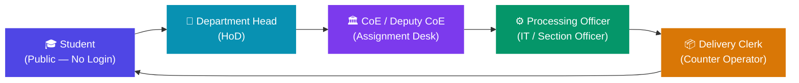
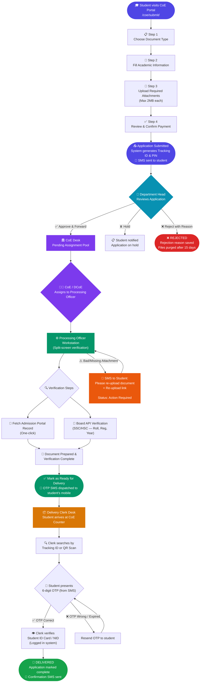
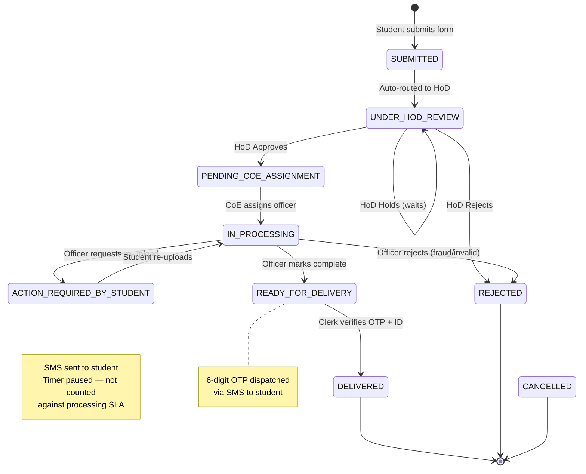
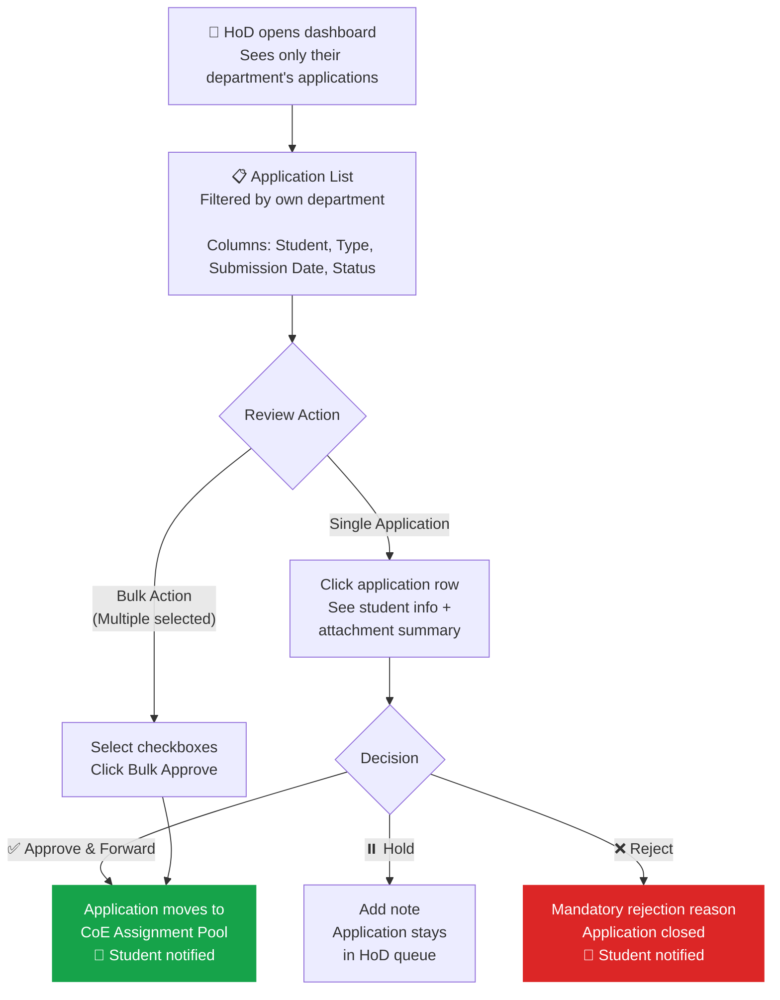
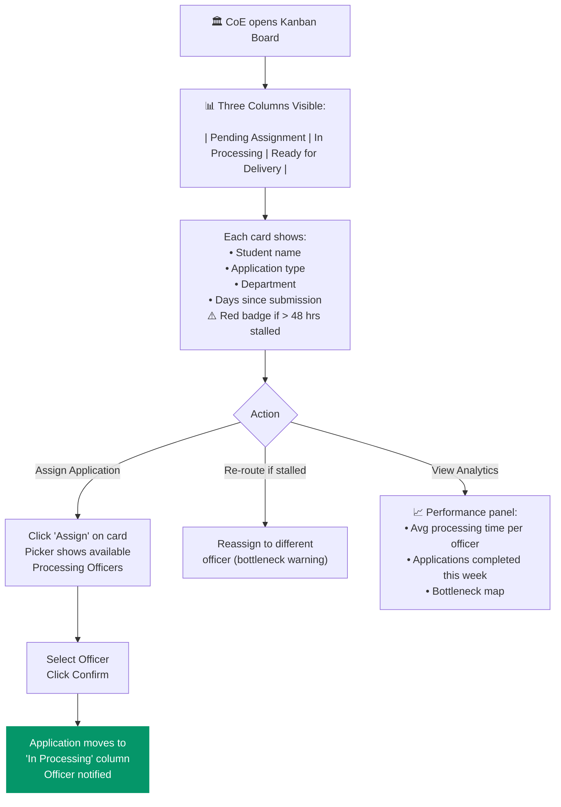
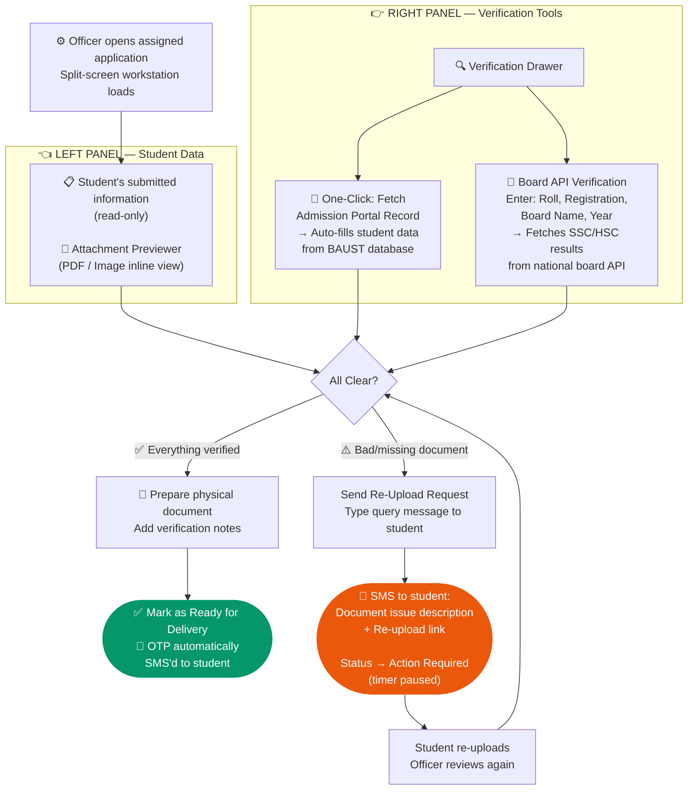
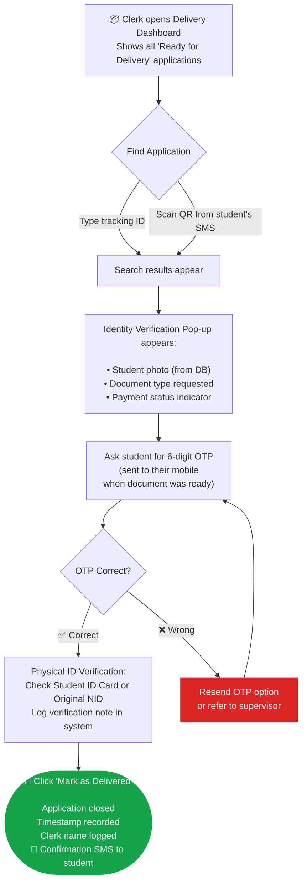
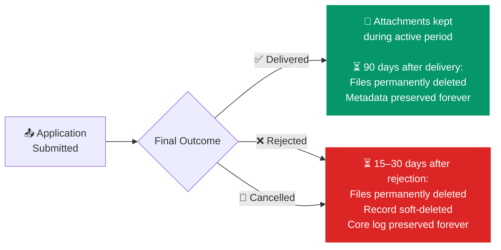

# 🎓 CoE Academic Document Processing — Complete Workflow Guide

> **Office of the Controller of Examinations (CoE)**
> BAUST Student Document Application Portal

---

## 📋 What is this system?

Students at BAUST who need official academic documents (certificates, transcripts, grade sheets, recommendation letters, etc.) must formally apply through the **CoE Portal**. This system manages the entire journey — from the student's online application all the way to physical document handover at the CoE Desk — with SMS notifications at every major step.

---

## 🗂️ Supported Document Types

| # | Document | Who Needs It |
|---|----------|-------------|
| 1 | **Main / Original Certificate** | Final year graduates |
| 2 | **Provisional / Main Academic Transcript** | Job or higher study applications |
| 3 | **Incomplete Academic Transcript** | Mid-study applications |
| 4 | **Student's Name Correction** | Name mismatch with NID/Board certificate |
| 5 | **Father/Mother Name Correction** | Parent name mismatch |
| 6 | **Recommendation Letter** | Scholarship, visa, job purpose |
| 7 | **Grade Sheet** | Specific semester/term grade record |
| 8 | **Duplicate Documents (as per GD)** | Replacement for lost documents |

---

## 👥 Who is Involved?

---

## 🔄 Full Application Lifecycle — At a Glance

---

## 🔢 Application Status — Complete State Map

---

## 🎓 Role 1 — Student (Public Portal, No Login Required)

```mermaid
flowchart LR
    S1["🌐 Visit\n/coe/submit/"] --> S2
    S2["Step 1️⃣\nSelect Document Type\n(8 options shown as cards)"] --> S3
    S3["Step 2️⃣\nFill Your Details\n(Fields change based on\ndocument type selected)"] --> S4
    S4["Step 3️⃣\nUpload Documents\n📎 Max 2MB per file\nInline preview shown"] --> S5
    S5["Step 4️⃣\nPayment Confirmation\n+ Final Review"] --> S6

    S6{"Submit?"}
    S6 -- Yes --> S7
    S6 -- Edit --> S3

    S7(["✅ Application Submitted!\n\n📋 Your Tracking ID: APP-2026-XXXX\n🔑 Your PIN: XXXX\n📱 SMS confirmation sent"])

    S7 --> TRACK

    TRACK["🔍 Track Your Application\n/coe/track/\n\nEnter: Tracking ID + Mobile\nor Student ID"]
    TRACK --> STATUS["📊 See your current stage\non a progress bar:\n\nSubmitted → HoD Review\n→ In Processing\n→ Ready → Delivered"]

    style S7 fill:#16a34a,color:#fff,stroke:none
    style TRACK fill:#4f46e5,color:#fff,stroke:none
```

---

## 🏫 Role 2 — Department Head (HoD)

---

## 🏛️ Role 3 — CoE / Deputy CoE (Assignment Kanban Desk)

---

## ⚙️ Role 4 — Processing Officer (Verification Workstation)

---

## 📦 Role 5 — Delivery Clerk (Counter Desk)

---

## 📱 SMS Notifications — Full Reference

| Event | Who Receives | Message (in Bangla) |
|-------|-------------|---------------------|
| 📤 Application Submitted | Student | Tracking ID + PIN provided |
| ✅ HoD Approved | Student | Application forwarded to CoE |
| ⚠️ Action Required | Student | Issue description + re-upload link |
| 📄 Ready for Delivery | Student | Document ready to collect + OTP |
| 🔁 OTP Resent | Student | New 6-digit OTP |
| 🎉 Delivered | Student | Confirmation of document handover |
| ❌ Rejected | Student | Rejection reason |

---

## 🗄️ Data Retention Policy

> **Why?** To keep server storage lean while preserving historical reporting integrity. All transaction records (who applied, what was processed, dates) remain permanently — only uploaded files are removed after the retention window.

---

## 🔐 Security Measures Summary

| Risk | Protection |
|------|-----------|
| Anyone claiming a document at counter | **6-digit OTP** must be provided (sent only to student's registered mobile) |
| Forged payment slips | Officer manually verifies at Processing Workstation; future: bKash/SSLCommerz integration |
| Unreadable/fraudulent attachments | `Action Required` state with officer query + student re-upload (workflow paused, not cancelled) |
| Application tracking without login | Requires **Tracking ID + Mobile Number** (two-factor lookup) |
| Stale data accumulating | Automated cron cleanup after retention windows |

---

## 📌 Quick Reference — Department Head Checklist

- [ ] Log in to the portal
- [ ] Go to **CoE → HoD Dashboard**
- [ ] Review pending applications in your department
- [ ] Check attached documents in each application
- [ ] Click **Approve & Forward** / **Hold** / **Reject with Reason**
- [ ] For bulk clear cases: use **Select All → Bulk Approve**

---

## 📌 Quick Reference — Processing Officer Checklist

- [ ] Log in to the portal
- [ ] Go to **CoE → Processing Workstation**
- [ ] Open your assigned application
- [ ] Click **Fetch Admission Record** (right panel)
- [ ] Fill in Board details → Click **Verify Board**
- [ ] Review all attachments in the left panel
- [ ] If issue: click **Request Re-Upload** → type message
- [ ] When all clear: click **Mark as Ready for Delivery**

---

## 📌 Quick Reference — Delivery Clerk Checklist

- [ ] Student arrives at CoE Counter
- [ ] Open **CoE → Delivery Desk**
- [ ] Search by Tracking ID or scan QR
- [ ] Identity verification pop-up appears — confirm student matches
- [ ] Ask student for the 6-digit OTP from their SMS
- [ ] Enter OTP → if correct, click **Mark as Delivered**
- [ ] System logs delivery with your name, time, and OTP confirmation
